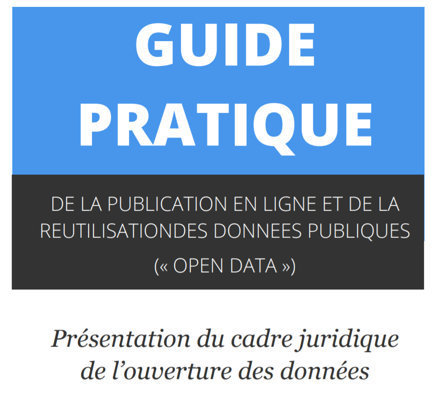
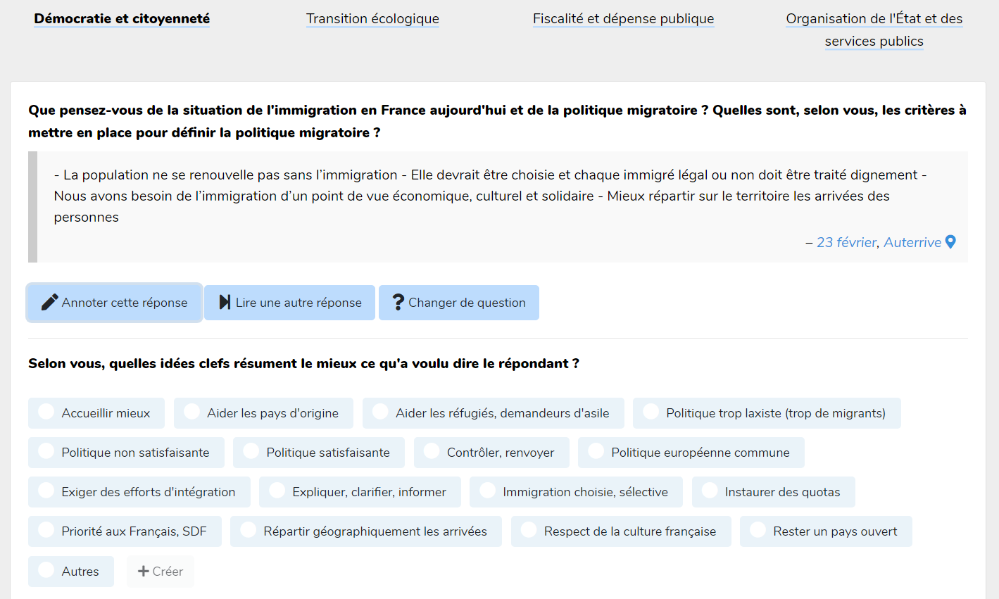
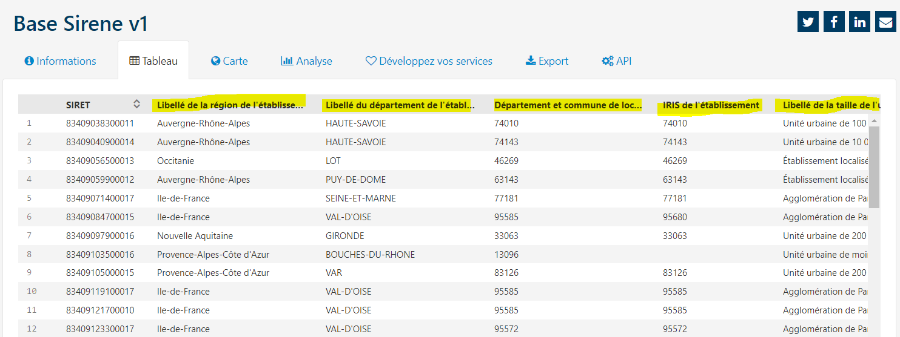
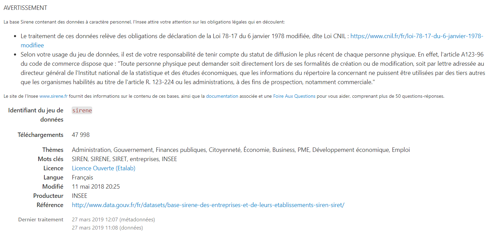

layout: true
  

`r paste0("
", params$event, " 

")` 

---

class: center, middle

Ces slides en ligne : http://datactivist.coop/unicergy/jour1.html

Sources : https://github.com/datactivist/unicergy/

Les productions de Datactivist sont librement réutilisables selon les termes de la licence [Creative Commons 4.0 BY-SA](https://creativecommons.org/licenses/by-sa/4.0/legalcode.fr).

 
 

.center[] 
---

## Qui sommes-nous ?

    

### We .red[open data], we make them .red[useful]

---
## Qui sommes-nous ?

- Datactivist est un .red[**pure player de l’open data**] créé en 2016, par Samuel Goëta et Joël Gombin.

- Se positionnant sur .red[**toutes les étapes du travail d’ouverture des données**], Datactivist travaille tant avec les producteurs de données qu’avec les réutilisateurs et participe à l’appropriation des données par chacun.

- Nous appliquons nos propres .red[**valeurs**] : nous sommes une coopérative ; nos supports de formation et nos contenus sont librement réutilisables, publiés en licence Creative Commons.

- Une approche issue de la recherche : voir notamment **https://datactivist.coop/these**. 

- Nous animons la communauté [#TeamOpenData](https://teamopendata.org).

---
## Nos activités

- Conseil sur les .red[**stratégies d’ouverture de données**] : nous aidons les organisations dans la conception et la mise en œuvre de leur stratégie d’ouverture de données.

- .red[**Accompagnement dans la réutilisation de données ouvertes**] : nous aidons les organisations à utiliser les données au quotidien. 

- .red[**Sensibilisation et formation à la donnée**] : nous formons à la culture générale des données, nous enseignons les grands principes et bonnes pratiques de l'open data et nous introduisons à la data science. 

- .red[**Médiation de données**] : nous organisons des hackathons, des open data camps, des expéditions de données...

???

La médiation de données est aussi fondamentalement une animation de communauté(s). 

---
## Qui suis-je ?

.center[]
.center[[**Timothée Gidoin**](timothee.gidoin@sciencespo.fr)]
.center[[*Twitter: TGidoin*](https://twitter.com/Tgidoin)]

- Cofondateur de [**Datagora**](www.datagora.fr)
- Consultant Open Data chez Datactivist
- Enseignant vacataire à Sciences Po, Sciences Po SGL
- Formateur Gouvernement ouvert

---
class: inverse, center, middle

## Et vous, qui êtes-vous ?

---
## Que va-t-on faire durant ce séminaire ?

--
.center[]

---
## Objectifs du séminaire

- Allier théorie et pratique sur l'utilisation des données et acquérir des connaissances et des compétences **concrètes** que vous pourrez mobiliser dans vos expériences journalistiques

- Vous présenter et faire expérimenter des outils gratuits d'analyse et de représentation graphique ou spatiale de données

- Vous sensibiliser sur les biais des données, l'importance de distinguer les sources, les erreurs classiques à éviter lorsqu'on utilise des données

- Vous faire découvrir des sources de données... et de sujets potentiellement infinis !

- Vous donner des ressources pour celles et ceux qui voudraient aller plus loin dans la manipulation des données

[**DISCLAIMER**] Je n'ai **pas** la science infuse et je ne suis **pas** un expert en journalisme => Participez et échangeons tout au cours de ce séminaire

---
## Détails des 3 jours :

.red[**Jour 1 - lundi 24 juin :**]
- Qu'est-ce qu'une donnée ? 
- L'open data, l'allié du journaliste
- Manipuler des données avec un tableur : du filtre au TCD

.red[**Jour 2 - mardi 25 juin :**]
- Les limites des données et les erreurs classiques d'interprétation
- Reconnaitre et distinguer les sources stats/études
- Représentation graphique et spatiale de données

.red[**Jour 3 - mercredi 26 juin :**]
- L'absence de données
- Récupérer des données autrement (scraping, CADA)
- Pour aller plus loin

.red[**Jour 4 - jeudi 27 juin : Projet de datajournalisme à rendre**]

---

## Objectifs de la journée

.red[**Matin**]
- Comprendre ce qu'est une donnée et appréhender la variété des types de données existantes [10h15-11h25]

*Pause 10 minutes ?*

- L'open data, un ami qui vous veut du bien [11h35-13h]

*Pause déjeuner 1 heure*

.red[**Après-midi**]
- Le data pipeline [14h-14h15]
- Exercice pratique : manipuler des données sur tableur Lvl1 [14h15-15h25]

*Pause 10 minutes ?*

- Exercice pratique : manipuler des données sur tableur Lvl2 [15h35-17h]

---
## May the data be with you !

.center[]

---
class: inverse, center, middle

# Culture des données

---
class:middle, center
## Echauffement :
### 2 minutes, 10 données

Vous avez 2 minutes

Vous devez trouver 10 données dans notre environnement immédiat

Pas de recours aux écrans !

.footnote[[source](http://infolabs.io/5-minutes-20-donnees)]

---
class:center,inverse, middle
# Qu'est-ce 
# qu'une donnée ?

---
Class:
## La pyramide Data-Information-Knowledge-Wisdom

.pull-left[

]

.pull-right[Attribuée à [Russell Ackoff](http://en.wikipedia.org/wiki/Russell_L._Ackoff), 1989

Les données peuvent être des :

- faits
- signal/stimulis
- symboles]

---
Class:
## La pyramide Data-Information-Knowledge-Wisdom

- Les **.red[données]** sont la matière "brute" d'où naît l'information.

- **.red[L'information]** pourrait être définie comme des données qui ont été consignées,
classées, organisées, raccordées ou interprétées dans un cadre qui en dégage le sens

- En donnant du sens à de l'information, on obtient de la **.red[connaissance]**

- En donnant du sens à la **.red[connaissance]** on obtient du savoir

---
Class:
## La pyramide Data-Information-Knowledge-Wisdom

.center[]

_NB : le haut de la pyramide, est parfois remplacé par "compétence"_

---
## Qu'est-ce qu'une donnée ?

> *Une donnée correspond à la représentation d'une information sous une forme conventionnelle destinée à faciliter son traitement*

.center[] 

.footnote[[source](https://www.cnil.fr/sites/default/files/atoms/files/guide_open_data.pdf)]
---
## Le censeur à Rome, ancêtre de la statistique
.center[] 

.footnote[Source : *Asterix chez les pictes*, © Albert René 2013]
---
## Le censeur à Rome, ancêtre de la statistique
.center[] 

.footnote[*Asterix chez les pictes*, © Albert René 2013]
---
## La statistique : outil de gouvernement et de preuve
.pull-left[.middle[La statistique est à la fois :

  + **Outil de gouvernement** (_Statistik_ - 18e siècle), et
  
  
  + **Outil de preuve** (_statistics_ - 19e siècle)]]
.pull-right[.reduite2[]]

---

## La "nombrification" du monde

.pull-left[.reduite[]]
.pull-right[
> La numérisation ne serait pas survenue sans une "nombrification" préalable qui consiste à quantifier de plus en plus d'aspects de notre expérience du réel.
> **Au commencement était le verbe, il semble à la fin que tout devient nombre.**
> Personne ne saurait parler sérieusement de l'état de la société et discuter politique sans se référer aux informations quantitatives.]

---
Class: middle, center

## La mise en données du monde

- Concrètement, aujourd'hui, quels aspects de votre vie sont mis en données ?

--

- Recherches internet, pratiques sportives, consommation énergie, régime alimentaire, trajets dans les transports en commun...

- Cette mise en donnée est rendue possible par le développement de .red[**capteurs**] qui viennent collecter et agréger ces données 

--

- Recherches internet .red[(cookies)], pratiques sportives .red[(montres connectées)], consommation énergie .red[(compteurs connectés)], régime alimentaire .red[(appli type Yuka)], trajets dans les transports en commun .red[(Pass Navigo)]...

- La question devient peut-être, *quels aspects de votre vie ne sont pas (encore) mis en données ?*

---
Class:

## Les données brutes sont un oxymore

.pull-left[
> Les données sont toujours "cuisinées" et jamais tout à fait "brutes"

> Les données ont besoin au préalable d'être imaginées comme données pour exister et fonctionner comme telles. L'imagination de ces données implique une base d'interprétation

]
.pull-right[

.footnote[© Xavier Gorce 2018]]

---
## Data or capta ?

> Techniquement, ce que nous nous appelons "donnée" est généralement **"capturé"** (issu du latin "capere", signifiant "prendre"); ces unités de données qui ont été sélectionnées et collectées parmi l'ensemble de toutes les données possibles

[Kitchin, 2014](https://books.google.fr/books?hl=fr&lr=&id=GfOICwAAQBAJ&oi=fnd&pg=PP1&dq=kitchin+data+revolution&ots=pcyfMTZh-V&sig=dQyPTL3AIN_4RdWvtBFw4VjdAa4#v=onepage&q=kitchin%20data%20revolution&f=false)

.center[] 

---

## Données ou obtenues ? 

> Décidément, on ne devrait jamais parler de “données”, mais toujours d’ “obtenues”.

[Bruno Latour, 1993](http://www.bruno-latour.fr/fr/node/255)

.center[] 

---
## Petit lexique autour des données

---

## Données quantitatives
.pull-left[
Différents types de variables : 
- **Nominale** : des catégories que l’on nomme avec un nom (marié/célibataire/divorcé/veuf)

- **Ordinale** : échelle de mesure dotant chaque élément d'une valeur qui permet leur classement par ordre de grandeur (faible, moyen, fort)

- **Intervalles** : l’intervalle entre deux catégories a toujours la même valeur (12-16°C / 16-20°C / 20-24°C) 
]
.pull-right[

]

---

## Données qualitatives

.pull-left[
Ce sont des données non numériques, par exemple du texte, des images, de la vidéo, du son...

  + Ces données peuvent être converties en données quantitatives

  + Mais on risque de perdre la richesse des données originales
  
  + Il est possible de réaliser une analyse qualitative de ces données
  
]
.pull-right[

]

---
## Exemple : les annotations en text mining

> L’annotation (ou l’étiquetage) est une tâche plus spécifiquement linguistique que les précédentes, au sens où elle ne s’applique pas, aux données tabulaires et ne relève donc pas de la fouille de données (data mining)

.center[]

.footnote[Source : [Introduction à la fouille de textes université de Paris 3 - Sorbonne Nouvelle](http://www.lattice.cnrs.fr/sites/itellier/poly_fouille_textes/fouille-textes.pdf)]
---
## Exemple : les annotations en text mining

> La donnée est exclusivement un texte brut ou un document semi-structuré non
transformé en tableau : elle est donc composée d’unités respectant au moins
une relation d’ordre.

> L’ensemble des étiquettes possibles est fini et connu à l’avance au moment où
le programme est appelé. Le résultat est la donnée initiale dans laquelle chaque unité est associée à une étiquette prise dans l’ensemble des étiquettes possibles 

> L’annotation peut aussi s’appliquer à d’autres données structurées que les textes : .red[on peut ainsi annoter des séquences audio ou vidéo], ou des bases de données XML par exemple. On parlera d’annotation quand la structure de la donnée d’origine se trouve ”reproduite” sur les étiquettes ajoutées par le programme.

.footnote[Source : [Introduction à la fouille de textes université de Paris 3 - Sorbonne Nouvelle](http://www.lattice.cnrs.fr/sites/itellier/poly_fouille_textes/fouille-textes.pdf)]

---
## Exemple : les annotations en text mining

.reduite[]

---

## Données structurées

.pull-left[
Des données dotées d'un modèle qui définit les relations entre les composantes de la base de données

  + Ex : base de données relationnelle SQL
  
  + Lisibles machine
  
  + Faciles à analyser, manipuler, visualiser...
]
.pull-right[

]

---

## Données structurées

Un exemple concret : le schéma de la base de données relationnelle derrière [la plateforme Datagora](https://www.datagora.fr/) 

.center[]

---

## Données semi-structurées

.pull-left[
Pas de modèle prédéfini : structure irrégulière, implicite... mais données organisées néanmoins, ensemble raisonnable de champs

Exemple : XML, JSON

Possible de trier, ordonner et structurer les données
]
.pull-right[

]

---

## Données non structurées

.pull-left[Pas de structure commune identifiable
Exemple : BDD NoSQL

Généralement qualitatives

Difficilement combinées ou analysées quantitativement

Les données non structurées croitraient 15x plus que les données structurées
 
Le machine learning est de plus en plus capable d'analyser ces données. *Voir sections 9 et 10*]

.pull-right[

]

---

## Données capturées, échappées, transitoires 

** Données capturées**

Données issues d'observations, d'enquêtes, d'expérimentations, de prise de notes, de senseurs... => il y a eu l'**intention de générer des données**

** Données échappées**

Sous-produit d'un engin ou d'un système dont la fonction première est autre
** Avez-vous des exemples de données échappées ?**
--
 
Parking, borne d'accès... => Des données sur les horaires d'accès, le nombre d'ouvertures, fermetures, la fréquentation

** Données transitoires**

Ce sont des données échappées qui ne sont jamais examinées, transformées ou analysées

---
## Données dérivées

Résultat d'un traitement ou d'une analyse supplémentaire de données capturées. 

Exemple avec les [données de Google Maps](https://www.justinobeirne.com/google-maps-moat) : 

Recommandé : Lire l'article ["GOOGLE MAPS’S MOAT - How far ahead of Apple Maps is Google Maps?"](https://www.justinobeirne.com/google-maps-moat)

---
class: inverse, center, middle

## 2. Données, données... quelles données ?

---

## Les données crowdsourcées

Des données produites par des citoyens, des communs partagés et gouvernés par leurs producteurs.

Concrètement, les données sont issues du travail collaboratif de divers acteurs, bénévoles, dans la récolte sur le terrain.

**Connaissez-vous un site ou une application fonctionnant via des données crowdsourcées ?**

--

.pull-left[Exemple : OpenStreetMap, le wiki de la carte]

.pull-right[
.reduite[]
]

---
## Exemple 1 : OpenStreetMap

> Pourquoi faites-vous OpenStreetMap ? 
Les données géographiques (géo-données) ne sont pas libres dans nombre de régions du monde, par exemple en France, en Belgique, au Canada. En général, ces régions ont confié la tâche de cartographie à diverses agences gouvernementales, qui en retour font de l'argent en revendant les données à des gens comme vous et moi. Si vous vivez dans un de ces pays, alors vos impôts servent à payer le travail de cartographie

> En France certaines données du ministère des finances (données cadastrales pour l'identification des parcelles) peuvent être réutilisées comme référence, mais avec des conditions qui ne permettent pas une exploitation massive permettant d'obtenir une carte complète (leur précision ne permet pas nécessairement d'identifier tous les chemins, rues et routes qui traversent une même parcelle ; de plus elles ne sont souvent plus à jour).

.footnote[ Source : [La FAQ d'OpenStreetMap](https://wiki.openstreetmap.org/wiki/FR:FAQ#Pourquoi_n.27utilisez_vous_pas_Google_Maps_ou_untel_pour_vos_donn.C3.A9es_.3F)]

---
## Exemple 1 : OpenStreetMap

En résumé :

+ OpenStreetMap (OSM) est un projet de cartographie qui a pour but de constituer une base de données géographiques libre du monde (permettant par exemple de créer des cartes sous licence libre), en utilisant le système GPS et d'autres données libres.

+ À la manière de Wikipédia, **tous les internautes naviguant sur le web peuvent contribuer à la création et à la numérisation de cartes**. Des éditeurs permettent de réaliser en ligne des cartes en se basant sur un fond d'image satellitaire. Cependant, ces images satellitaires ne couvrent pas toujours en haute résolution l'ensemble du globe. C'est pourquoi il est possible d'introduire des données provenant de récepteurs GPS. Il suffit pour cela de réaliser un itinéraire et de positionner le récepteur en mode enregistrement, puis de le restituer sur le serveur de données d'OpenStreetMap 

---
## Exemple 1 : OpenStreetMap

Vous aussi vous pouvez contribuer à OpenStreetMap !

.center[] 

---
## Exemple 2 : OpenFoodFacts

.center[] 

> Open Food Facts est une base de données sur les produits alimentaires faite par tout le monde, pour tout le monde. Elle vous permet de faire des choix plus informés, et comme les données sont ouvertes (open data), tout le monde peut les utiliser pour tout usage.

> Open Food Facts est un projet citoyen à but non lucratif créé par des milliers de volontaires à travers le monde. Vous pouvez commencer à contribuer en ajoutant un produit de votre cuisine, et nous avons plein de projets enthousiasmants auxquels vous pouvez participer de beaucoup de façons différentes.

---
## Exemple 2 : OpenFoodFacts

Vous aussi vous pouvez contribuer à OpenFoodFacts !

.center[]

---
## Exemple 2 : OpenFoodFacts  

Et vous connaissez très probablement une application qui utilise les données d'OpenFoodFacts pour "évaluer" la composition des produits alimentaires...

--

**Yuka** ! Avec plus de 8 millions d'utilisateurs en février 2019, elle a désormais un impact non négligeable, y compris dans la stratégie des grandes marques de l'agroalimentaire..

.center[]

---
## La Grande Annotation 

**L'objectif ?** Faire en sorte que les contributions au grand débat puissent être lues et comprises. Tout un chacun peut, sur le site [grandeannotation.fr](https://grandeannotation.fr/) lire ces textes, classés par thème et par question, et les annoter pour en révéler le sens.

.center[]

Plutôt que d'obtenir une synthèse des contributions au grand débat qui soit non collaborative, opaque (car réalisée par quelques sociétés) et en partie traitée par de l'intelligence artificielle, la Grande Annotation veut construire une synthèse collective, transparente et fondée sur l'intelligence humaine.

---
## La Grande Annotation 

**Vous aussi vous pouvez contribuer en annotant les réponses au grand débat !**
Ce faisant, vous créez de fait de nouvelles données qui viennent qualifier et enrichir les données initiales.

.center[]
---
class: inverse, center, middle

## 3. Petit lexique autour des données 

---

##Index

**Index** : Des données permettent l'identification et la mise en relation. Essentielles pour enrichir les données. Exemple : le numéro de SIRET dans la base Sirene (informations concernant les entreprises et les établissements immatriculés au répertoire interadministratif Sirene depuis sa création en 1973), gérée par l'Insee

.center[]

---

## Attributs

**Attributs** : Des données représentent les aspects d'un phénomène, mais ne sont pas des index (pas identifiants uniques). Exemples avec la base Sirene : région de l'établissement, département de l'établissement, Iris de l'établissement...

.center[]

---

## Métadonnées 

**Métadonnées** : Des données sur les données. Peuvent être descriptives, structurelles ou administratives. Exemple de standard : le [Dublin Core](https://fr.wikipedia.org/wiki/Dublin_Core). 

Pour notre exemple précédent, les métadonnées (date de modification, producteur, nombre de téléchargements, thématiques...) sont les suivantes :

.center[]

---
class:center, middle, inverse
##Pause café : 10 minutes

---
class: inverse, center, middle

## 2. Open data : les grands principes

---

class: inverse, center, middle

# Merci !

Contact : [timothee@datactivi.st](mailto:timothee@datactivi.st)