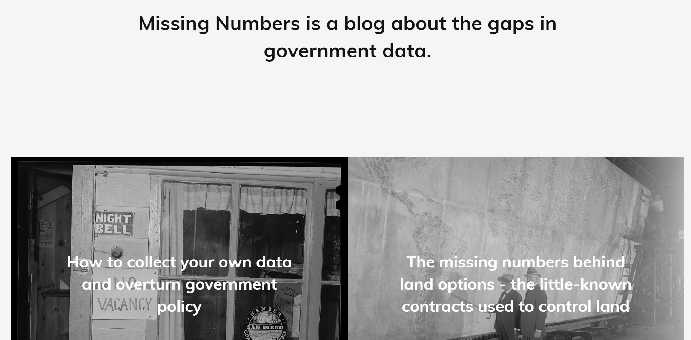
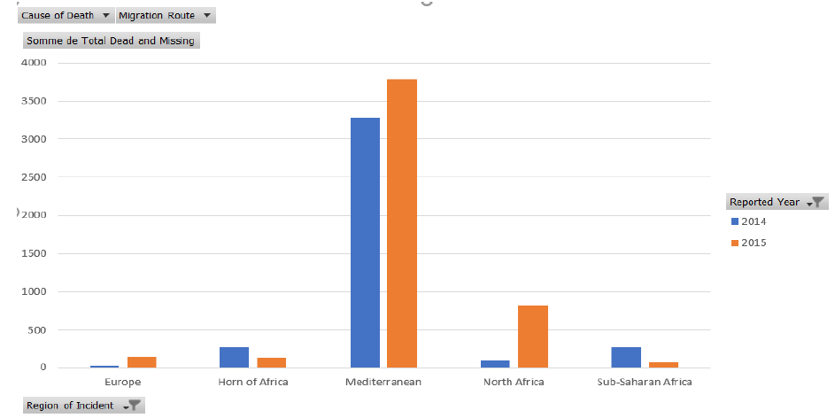

layout: true
  

`r paste0("
", params$event, " 

")` 

---

class: center, middle

Ces slides en ligne : http://datactivist.coop/unicergy/jour3.html

Sources : https://github.com/datactivist/unicergy/

Les productions de Datactivist sont librement réutilisables selon les termes de la licence [Creative Commons 4.0 BY-SA](https://creativecommons.org/licenses/by-sa/4.0/legalcode.fr).

 
 

.center[] 

---

class: inverse, center, middle

# Vos retours sur la journée d'hier

---

## Des progrès... au calme !

.center[]

---

## Objectifs de la journée

.red[**Matin**]
- Exercice : nettoyer, manipuler et visualiser des données [9h-10h25]

*Pause 5 minutes*

- L'absence de sources de données [10h30-11h15]

- Exercice pratique : représenter des données avec RawGraphs [11h15-12h]

*Pause déjeuner 1 heure*

.red[**Après-midi**]

- Panorama des formats et des outils de data visualisation [13h-14h25]

*Pause 5 minutes*

- Pour aller plus loin [14h30-15h30]

- Préparation de l'exercice de dataviz à rendre pour le J4

---
class: inverse, center, middle

# Back in the game

---
## Infographie publiée avant-hier

Est-ce que ça vous semble toujours inaccessible ?

.center[] 

---
## Analyse et visualisation de données : ISF

Représentez dans Khartis le nombre de redevables ISF en île-de-France

.center[] 

---
## Analyse et visualisation de données : délinquance

- Retrouvez le fichier des crimes et délits enregistrés par les forces de l'ordre depuis 2012

- Téléchargez-le et reformatez-le de manière à avoir un tableur propre

- Faites un TCD pour avoir une vision d'ensemble des crimes et délits par département

- Récupérez la population de chaque département via le fichier du recensement par commune

- Choisissez deux variables "phares" rapportées au nombre d'habitants et représentez les sur Khartis via une carte des départements en superposant les 2 variables

---
class:center, middle, inverse

##Pause café : 5 minutes

---
class: inverse, center, middle

## L'absence de données : compter pour être pris en compte

---
## Un sujet sans données, peut-il exister dans le débat public ?

.pull-left[]

.pull-right[]

.center[.footnote[© Xavier Gorce 2018]]

---
## Un sujet sans données, peut-il exister dans le débat public ?

> Être ignoré de la statistique, c’est être exclu de la cité, de la citoyenneté

Maryse Marpsat, statisticienne et sociologue (INED)

#### Connaissez-vous des thématiques pour lesquelles .red[il n'existe pas de données officielles] ?

--

Deux exemples : 

- Le nombre de sans domicile fixe (SDF) en France

- Le nombre de migrants qui décèdent aux portes de l'EUrope

---
## L'exemple des migrants disparus ou décédés

**Ne pas collecter de données, un acte très .red[politique]**

> Les Etats de l’UE documentent méticuleusement l’état de leur propre population ainsi que l’entrée sur leur territoire de citoyens étrangers, mais ils accordent très peu d’attention, dans leur pratique statistique, aux personnes mortes en tentant de traverser leurs frontières

Antoine Pécoud, sociologue

> **En omettant de recenser ces morts, les Etats européens les condamnent à l’invisibilité**. Faute de statistiques, ils ne sont rien d’autre que des décès fortuits, connus des seuls habitants des rivages concernés ou de quelques rares spécialistes.

##### A l'opposé, depuis 1998, l’agence fédérale chargée de surveiller la frontière avec le Mexique tient un registre statistique précis du nombre de décès.
---
## L'exemple des migrants disparus ou décédés

- Cependant l'absence de données officielles peut être en partie contournée. Des personnes ou des organisations peuvent en effet décider de collecter des données par leurs propres moyens de manière à mettre la lumière sur un sujet.

- De nombreuses ONG dénombrent les migrants ou réfugiés qui décèdent dans leur tentative de rejoindre l'Europe. Quelques exemples :

---
## L'exemple des migrants disparus ou décédés

**.red[1) UNITED Against Refugees Deaths]**

.center[]

.footnote[[*The UNITED list of deaths of refugees and migrants while attempting to enter Europe*](http://www.unitedagainstracism.org/wp-content/uploads/2017/06/ListofDeathsActual.pdf)]

---
## L'exemple des migrants disparus ou décédés

**.red[2) The migrant files database]**

.center[]

.footnote[[*The Migrant Files’ database, created by a consortium of journalists from over 15 European countries*](http://www.themigrantsfiles.com/)]

---
## L'exemple des migrants disparus ou décédés

**.red[3) Missing Migrants Project]**

.center[]

.footnote[[*Missing Migrants Projects*](https://missingmigrants.iom.int/)]

---
## L'exemple des migrants disparus ou décédés

**.red[3) Missing Migrants Project]**

- Le projet Missing Migrants, organisé par l'Organisation Internationale des Migrations (OIM), agence de l'ONU, enregistre les incidents impliquant des migrants qui ont disparu ou sont décédés au cours de leur migration. 

- L'OIM **agrège dans .red[une base de données publique] différentes sources d'informations** (gardes-côtes, pêcheurs, ONG, filiales d'agences internationales, médias...) et y ajoute même une note de qualité pour qualifier la fiabilité des sources.

- Ce travail de recensement par une organisation internationale reconnue permet de **légitimer les statistiques obtenues et de sensibiliser l'opinion**. C'est une manière de **.red[rendre visible le sujet et de l'inscrire à l'agenda]**. Il semble qu'il est bien souvent nécessaire de *quantifier un sujet si on souhaite que celui-ci .red["compte" dans le débat public.]*

---
## Missing numbers : un blog dédié aux données absentes

.center[]

.footnote[[Missing numbers](https://missingnumbers.org/)]
---

## Exercice pratique : missing migrants

- Téléchargez la base de données de l'OIM Missing migrants

.center[]

---

## Exercice pratique : missing migrants

- Une fois les données nettoyées, allez sur [RawGraphs](https://rawgraphs.io/)

.center[]

---

class: inverse, center, middle

# Pause déjeuner \o/

---

class: inverse, center, middle

## Formats et outils de data visualisation

---
## Ne pas réinventer la poudre...

.center[]

---

class: inverse, center, middle

## Pour aller plus loin

---

class: inverse, center, middle

## Le projet de datajournalisme

---

class: inverse, center, middle

# Merci !

Contact : [timothee@datactivi.st](mailto:timothee@datactivi.st)